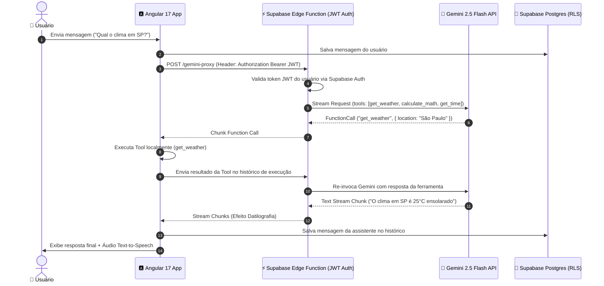

# 💬 Vox AI Agent | Angular 17 • Gemini 2.5 • Supabase

[](https://angular.dev/)
[](https://supabase.com/)
[](https://ai.google.dev/)
[](https://www.typescriptlang.org/)
[](https://vox-ai-chat.vercel.app/login)

O **Vox AI Agent** é uma aplicação web de alta performance desenvolvida com **Angular 17**, integrando o **Supabase** como BaaS (Autenticação, PostgreSQL com RLS e Deno Edge Functions) e a API do **Google Gemini 2.5 Flash** como motor para um **Agente Autônomo com Loop ReAct e Function Calling**.

---

## 🌟 Destaques de Arquitetura & Engenharia (Visão Geral para Recrutadores)

Este projeto foi construído seguindo boas práticas avançadas de engenharia de software e segurança:

1. **🛡️ Segurança & Autenticação de Endpoints (Zero-Trust):** O consumo da IA passa por um proxy seguro hospedado em **Supabase Deno Edge Functions**. Nenhuma API Key é exposta no cliente. A Edge Function valida os tokens **JWT Bearer** do usuário antes de repassar a requisição ao Gemini.
2. **🔄 Agente Autônomo com Function Calling (ReAct Loop):** A IA decide autonomamente quando invocar ferramentas externas (ex: consultar hora local, clima ou cálculos matemáticos) e sintetiza o resultado em tempo real.
3. **📜 Schema de Banco de Dados Versionado (Migrations & RLS):** Histórico de conversas e perfis gerenciados via PostgreSQL no Supabase com isolamento multi-tenant garantido por **Row Level Security (RLS)** e migrações SQL versionadas em `supabase/migrations/`.
4. **⚙️ Esteira CI/CD Automatizada:** GitHub Actions configurado para linting, checagem de tipos, testes unitários automatizados (`Karma/Jasmine`) e validação de build de produção.
5. **🎙️ Speech-to-Text & Text-to-Speech:** Integração nativa com a Web Speech API para ditado de áudio e sintetização de voz do agente em tempo real.

---

## 🛠️ Stack Técnica e Arquitetura

| Categoria | Tecnologia | Implementação |
| :--- | :--- | :--- |
| **Frontend** | **Angular 17** | Componentes Standalone modulares, RxJS e arquitetura Reativa. |
| **Backend & Banco** | **Supabase Postgres** | PostgreSQL com RLS, Triggers e Índices de Performance. |
| **Autenticação** | **Supabase Auth / Google OAuth2** | Autenticação via Email/Senha e Social Login com Google. |
| **Edge Compute** | **Deno Edge Functions** | Proxy de IA com validação de JWT e cabeçalhos CORS restritos. |
| **Inteligência Artificial** | **Google Gemini 2.5 Flash** | Agente ReAct com suporte a Streaming, Visão Multimodal e Tools. |
| **DevOps & QA** | **GitHub Actions / Prettier** | Automação de CI, cobertura de testes e padronização de código. |

---

## 🔄 Fluxo de Execução do Agente Autônomo (ReAct Loop)



---

## 💻 Como Executar o Projeto Localmente

### Pré-requisitos
- **Node.js**: `v20.x` ou superior
- **npm**: `v10.x` ou superior
- **Angular CLI**: `v17.x`

### Passo a Passo

```bash
# 1. Clonar o repositório
git clone https://github.com/PauloCatto/vox-ai-chat.git
cd vox-ai-chat

# 2. Instalar as dependências
npm install

# 3. Iniciar o servidor de desenvolvimento
npm run dev
# Acesse em http://localhost:4200
```

### 🧪 Executando Testes Unitários

```bash
# Executar testes unitários com relatório de Cobertura (Code Coverage)
npm run test:cov
```

---

## 📸 Visualização da Interface

### 1. Autenticação e Social Login
*Interface de entrada com suporte a credenciais padrão e Login via Google (OAuth2).*
<br>


<br>

### 2. Gestão de Conversas (CRUD)
*Demonstração do chat em tempo real, edição de títulos e confirmação de exclusão.*
<br>


<br>

### 3. Evidência de Cobertura de Testes (QA)
*Relatório de cobertura comprovando a saúde técnica do projeto.*
<br>


<br>

---

## 🌐 Deploy e Acesso

- **Aplicação em Produção (Vercel):** [vox-ai-chat.vercel.app](https://vox-ai-chat.vercel.app/login)

---

*Desenvolvido por **Paulo Catto**.*
